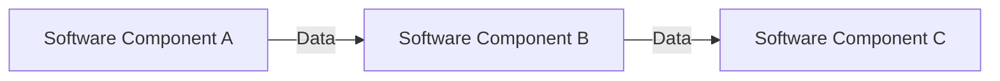
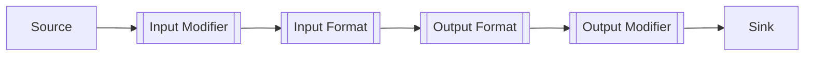
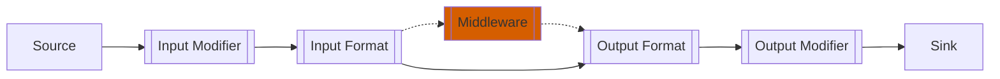
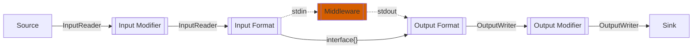
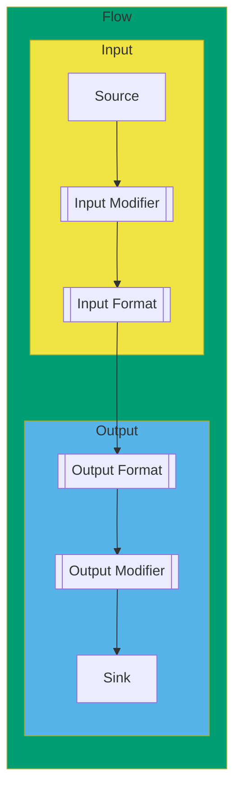

## Introduction

`vhs` is a network traffic utility that works by chaining modules or plugins. It offers a high-performance concurrent architecture for routing data and executing modules that enables users to configure and extend `vhs` for a variety of purposes, including traffic recording, replay, live metrics collection, and many others.

## Concepts

The architecture of `vhs` is built around the concept of a data flow, a directed graph that represents the routing of a stream of data through sofrware components that act on that data stream. In a data flow graph, nodes represent software components that originate, terminate, or modify the data stream passing through them, and edges represent the data stream passing between components. A data flow graph might look something like this:



In `vhs`, the data flow graph looks something like this:



Where each node represents a particular type of software component and the edges represent the connections between those components. The following two subsections will describe the components and connections that make up the `vhs` data flow in more detail.

### Nodes: VHS Components

Each node in the graph represents a concurrently-executed software component. In `vhs`, these components fall into four categories, as listed below:

- `source`: **source** components originate data streams. A source brings data into `vhs` from somewhere else. This could mean capturing data from a network interface, reading from cloud storage, reading from a local file, etc. More information on the internal architecture of source components can be found [here](/vhs/architecture/source), and information about the sources currently available in `vhs` can be found [here](/vhs/reference/#sources).
- `modifier`: **modifier** components modify the data passing through them in its raw format (stream of bytes). More information about the architecture of modifiers can be found [here](/vhs/architecture/modifier), and information about the input and output modifiers currently avaialable in `vhs` can be found here: [input modifiers](/vhs/reference/#input-modifiers) and [output modifiers](/vhs/reference/#output-modifiers).
- `format`: **format** components modify or interpret the data passing through them by imposing a format on it, usually in terms of native Go datatypes. More information about the architecture of formats can be found [here](/vhs/architecture/format), and information about the input and output formats currently avaialable in `vhs` can be found here: [input formats](/vhs/reference/#input-formats) and [output formats](/vhs/reference/#output-formats).
- `sink`: **sink** components terminate data streams. A sink provides a way for data to leave `vhs`. This data could be written to a file, stored on cloud storage, transmitted to a network location, etc. More information on the internal architecture of sink components can be found [here](/vhs/architecture/sink), and information about the sinks currently available in `vhs` can be found [here](/vhs/reference/#sinks).

As seen in the diagram above, formats and modifiers are present in both the input portion and the output portion of the `vhs` data flow. Additionally, `vhs` provides an optional facility for **middleware**. The middleware facility allows users to place their own external modifier code into the `vhs` data flow. If used, the middleware is placed into the data flow between the output format and the output modifier as shown in the diagram below. This external middelware will receive formatted data from the chosen output format on `stdout` and must write modified data to `stdin`.



### Edges: Connections Between Components

The edges of the data flow graph represent data streams that pass between components. In `vhs`, these edges represent the connections between the components described in the previous section. These connections are implemented using channels, a facility for communication between concurrent software components provided by the Go language. Channels in Go are strongly typed, so channel connections between `vhs` components utilize Go interface types and data types. Where raw data streams are needed, `vhs` uses types from the `io` package in the Go standard library, specifically the `io.ReadCloser` interface. Where structured data needs to be passed between components, the empty interface type `interface{}` is used for maximum flexibility.

#### Metadata

Sometimes it is useful to pass descriptive information about a data stream between two connected components. For example, the `tcp` source tracks information about source and destination IP addresses and ports for the tcp streams it captures. This information may be useful to components downstream in the `vhs` data flow, so `vhs` provides a metadata facility for recording this type of information and passing it between components. This metadata facility is implemented with a construct called `Meta` that is implemented in [`/flow/meta.go`](https://github.com/rename-this/vhs/blob/main/flow/meta.go).

```go
// Meta is a map of flow-related metadata.
type Meta struct {
  SourceID string

  mu     sync.RWMutex
  values map[string]interface{}
}
```

To pass `Meta` between components, it is wrapped together with an `io.ReadCloser` into struct. For example, the `InputReader` interface is used as the connection between a source and an input modifier. It is defined as follows:

```go 
// InputReader is an input reader.
type InputReader interface {
  io.ReadCloser
  Meta() *Meta
}
```

Putting this all together, we can see the components and their connections on the following data flow graph: 



More details on the implementation of each component and the connections between them can be found on their pages in this section.

## Supporting Infrastructure

`vhs` provides several software constructs to implement and manage its data flow and modules.

- `flow`: Flow is the highest level construct. It contains the input chain and output chains and manages the execution of all the modules for a given `vhs` session. Defined in
[`/flow/flow.go`](https://github.com/rename-this/vhs/blob/main/flow/flow.go).
- `input`: The input construct contains and manages the input chain of a `vhs` data flow. `vhs` supports a single input chain per session. Defined in
[`/flow/input.go`](https://github.com/rename-this/vhs/blob/main/flow/input.go).
- `output`: The output construct contains and manages the output chain(s) of a `vhs` data flow. `vhs` supports multiple output chains per session. Defined in
[`/flow/output.go`](https://github.com/rename-this/vhs/blob/main/flow/output.go).

The conceptual arrangment of these constructs is shown in the figure below. In most cases, it should not be necessary to modify these portions of the codebase when adding new data flow components, but a general understanding of these constructs should be helpful for both `vhs` developers and end users.



## Parser: Specifying VHS data flows

`vhs` data flows are defined at runtime with command line flags as described on the reference page ([Inputs](/vhs/reference/#inputs) and [Outputs](/vhs/reference/#outputs)). Internally, these flags are processed by a parser. This parser reads the specified input and output chain descriptions and instantiates a `Flow` that contains the specified components. All components must register with the parser by calling the appropriate `Load...` function with the identifying token and the constructor for the component. The parser is implemented in [`/flow/parser.go`](https://github.com/rename-this/vhs/blob/main/flow/parser.go) and component registration with the default `Parser` is done in [`/cmd/vhs/main.go`](https://github.com/rename-this/vhs/blob/main/cmd/vhs/main.go).
